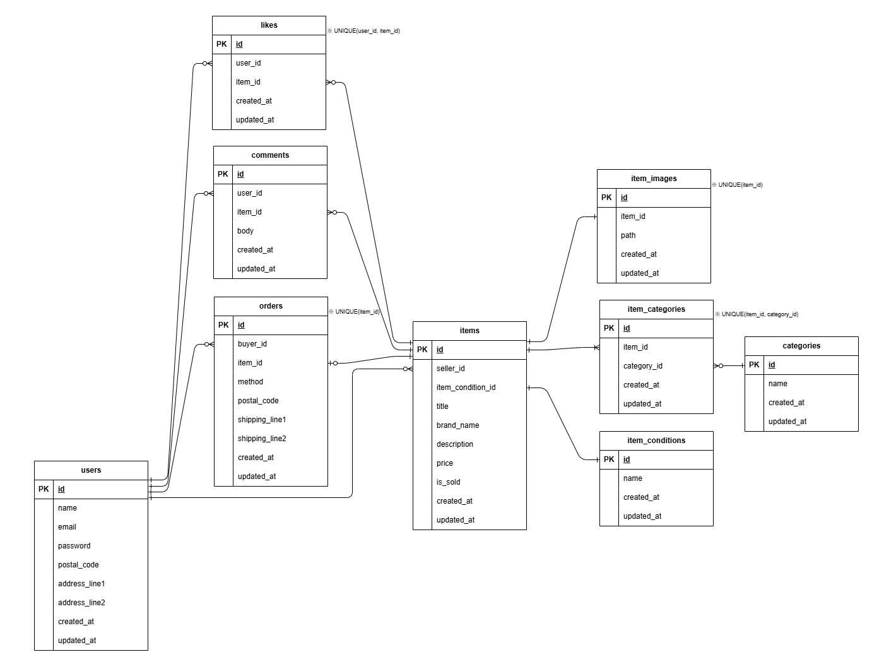

# PiGLy(体重管理アプリ)
PiGLyは、日々の体重・食事カロリー・運動時間を記録し、
目標体重に向けて健康管理を行うための体重管理アプリです。

ユーザー登録後、ログインすることで
各ユーザーごとに体重ログの記録・検索・編集・削除ができます。
また、目標体重を設定し、現在の進捗を確認することが可能です。　　

## 環境構築
**Dockerビルド**
1. `git clone git@github.com:marikoinukai/pigly.git`
2. DockerDesktopアプリを立ち上げる
3. `docker-compose up -d --build`

> *MacのM1・M2チップのPCの場合、`no matching manifest for linux/arm64/v8 in the manifest list entries`のメッセージが表示されビルドができないことがあります。
エラーが発生する場合は、docker-compose.ymlファイルの「mysql」内に「platform」の項目を追加で記載してください*
``` bash
mysql:
    platform: linux/x86_64 # Mac(M1/M2)でビルドできない場合に追加
    image: mysql:8.0.26
    environment:
```

**Laravel環境構築**
1. `docker-compose exec php bash`
2. `composer install`
3. 「.env.example」ファイルを 「.env」ファイルに命名を変更。または、新しく.envファイルを作成
4. .envに以下の環境変数を追加
``` text
DB_CONNECTION=mysql
DB_HOST=mysql
DB_PORT=3306
DB_DATABASE=laravel_db
DB_USERNAME=laravel_user
DB_PASSWORD=laravel_pass
```
5. アプリケーションキーの作成
``` bash
php artisan key:generate
```

6. マイグレーションの実行
``` bash
php artisan migrate
```

7. シーディングの実行
``` bash
php artisan db:seed
```
### ダミーデータ
シーディングの実行で、テストユーザー1名と、weight_target 1件・weight_logs 35件を作成します。
- email: test@example.com
- password: password123

## 使用技術(実行環境)
- PHP 8.1.34
- Laravel 8.83.8
- MySQL 8.0.26
- nginx 1.21.1

## ER図

※ er.drawio は編集用の元データです

## テーブル仕様
### users
| カラム | 型 | 説明 |
|--------|---------|-------------|
| id | bigint | ユーザーID |
| name | string | ユーザー名 |
| email | string | メールアドレス |
| password | string | パスワード(ハッシュ化) |
| created_at | timestamp | 作成日時 |
| updated_at | timestamp | 更新日時 |

### weight_logs
| カラム | 型 | 説明 |
|--------|---------|-------------|
| id | bigint | ログID |
| user_id | bigint | ユーザーID(FK) |
| date | date | 記録日 |
| weight | decimal(4,1) | 体重(kg) |
| calories | integer | 摂取カロリー |
| exercise_time | time | 運動時間 |
| exercise_content | text | 運動内容 |
| created_at | timestamp | 作成日時 |
| updated_at | timestamp | 更新日時 |

### weight_target
| カラム | 型 | 説明 |
|--------|---------|-------------|
| id | bigint | 目標ID |
| user_id | bigint | ユーザーID(FK) |
| target_weight | decimal(4,1) | 目標体重 |
| created_at | timestamp | 作成日時 |
| updated_at | timestamp | 更新日時 |


## URL
- 開発環境：http://localhost/
- ユーザー登録：http://localhost/register
- ログイン：http://localhost/login
- phpMyAdmin：http://localhost:8080/

## 補足
exercise_content カラムを nullable に変更するマイグレーションで
Laravel の仕様上 doctrine/dbal (v3系) を使用しています。
composer install 実行時に自動でインストールされます。
