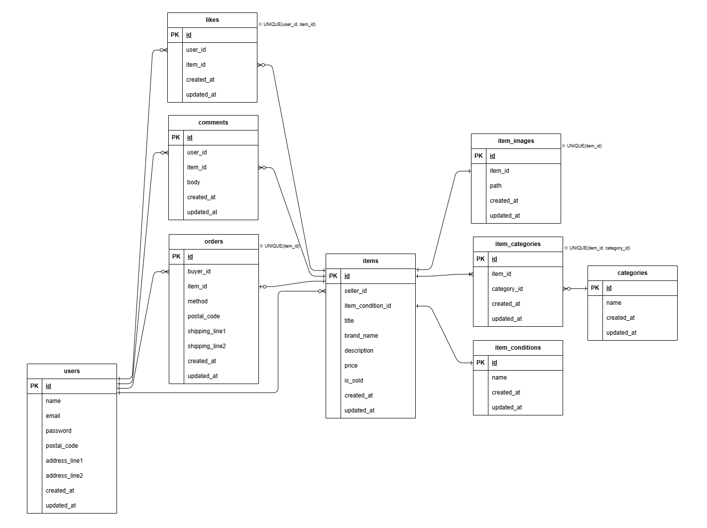

# coachtechフリマ
coachtechフリマは、商品一覧の閲覧、商品詳細の確認、いいね、コメント、出品、購入ができるフリマアプリです。

会員登録後にログインすることで、商品へのいいね、コメント投稿、商品出品、商品購入、プロフィール編集、マイページ機能を利用できます。
また、メール認証機能と Stripe を用いた決済機能を実装しています。

## 環境構築
**Dockerビルド**
1. `git clone git@github.com:marikoinukai/mock1-flea-market.git`
2. Docker Desktopアプリを立ち上げる
3. `docker-compose up -d --build`

> *MacのM1・M2チップのPCの場合、`no matching manifest for linux/arm64/v8 in the manifest list entries`のメッセージが表示されビルドができないことがあります。
エラーが発生する場合は、docker-compose.ymlファイルの「mysql」内に「platform」の項目を追加で記載してください*
``` bash
mysql:
    platform: linux/x86_64 # Mac(M1/M2)でビルドできない場合に追加
    image: mysql:8.0.26
    environment:
```

**Laravel環境構築**
1. `docker-compose exec php bash`
2. `composer install`
3. 「.env.example」ファイルをコピーして 「.env」ファイルを作成
``` bash
cp .env.example .env
```

4. .envに以下の環境変数を追加
``` text
DB_CONNECTION=mysql
DB_HOST=mysql
DB_PORT=3306
DB_DATABASE=laravel_db
DB_USERNAME=laravel_user
DB_PASSWORD=laravel_pass

MAIL_MAILER=smtp
MAIL_HOST=mailhog
MAIL_PORT=1025
MAIL_FROM_ADDRESS=example@example.com
MAIL_FROM_NAME="${APP_NAME}"

STRIPE_KEY=your_stripe_publishable_key
STRIPE_SECRET=your_stripe_secret_key
```
5. アプリケーションキーの作成
``` bash
php artisan key:generate
```

6. マイグレーションの実行
``` bash
php artisan migrate
```

7. シンボリックリンクの作成
``` bash
php artisan storage:link
```

8. シーディングの実行
``` bash
php artisan db:seed
```
## トラブルシューティング
### 権限エラーが発生する場合
環境によっては、storage と bootstrap/cache の書き込み権限が不足し、以下のような permission denied エラーが発生することがあります。
- /var/www/storage/logs/laravel.log
- /var/www/storage/framework/views/...

その場合は、PHP コンテナ内で以下を実行してください。
```bash
chmod -R 777 storage bootstrap/cache
php artisan config:clear
php artisan cache:clear
php artisan view:clear
```

その後、再度以下のコマンドを実行してください。
```bash
php artisan migrate
php artisan storage:link
php artisan db:seed
```

## 認証機能について
- 会員登録・ログイン・ログアウト・メール認証は Laravel Fortify を用いて実装しています。
- `/login`、`/register`、`/email/verify` は Fortify のルートを使用しています。
- 旧 `Auth::routes()` 依存は解消済みです。

## ダミーデータ
シーディングの実行で、以下のデータを作成します。

1. テスト出品者1名（登録ユーザーが存在しない場合）
- name: テスト出品者
- email: test@example.com

2. ダミー商品10件
- 販売価格
- ブランド名
- 商品の説明
- 商品画像（外部URLを利用）
- 商品の状態
- カテゴリー

必要に応じて以下で再作成できます。
``` bash
php artisan migrate:fresh --seed
```

## 使用技術（実行環境）
- PHP 8.1.34
- Laravel 8.83.8
- MySQL 8.0.26
- nginx 1.21.1
- Laravel Fortify
- Stripe
- MailHog
- Docker / Docker Compose

## 主な機能
- 会員登録
- ログイン / ログアウト
- メール認証
- 商品一覧表示
- 商品詳細表示
- 商品検索
- いいね機能
- コメント機能
- マイリスト表示
- 商品出品
- 商品購入
- 配送先変更
- マイページ表示
- Stripe 決済連携

## 主なテーブル
- users
- items
- item_images
- categories
- item_categories
- item_conditions
- orders
- likes
- comments

## URL
- 開発環境：http://localhost/
- ユーザー登録：http://localhost/register
- ログイン：http://localhost/login
- MailHog： http://localhost:8025/
- phpMyAdmin：http://localhost:8080/

## ER図

※ er.drawio は編集用の元データです

